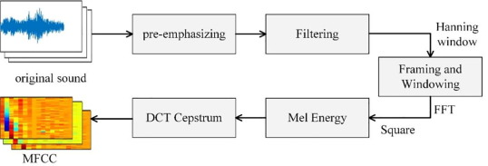
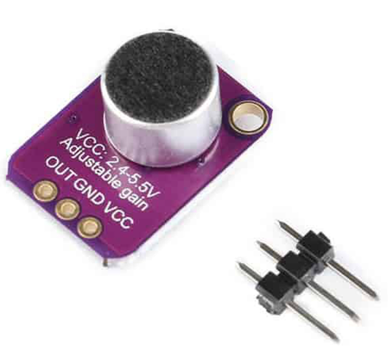

 <h1 align="center">Speech recognition on STM32 by using STMCube-Ai</h1>

## Introduction

Here is my python source code for speech recognition - a neural network model is deployed on STM32. with my code, you could: 
* **Extract audio features and train the model**
* **Optimize the model on STM32 hardware using the STM-Cube-Ai library**

## Extraction audio
I use Google's simple audio suite, you can access it via the following link: **'http://download.tensorflow.org/data/speech_commands_v0.02.tar.gz'**. I use the **MFCC** transform to be able to extract audio features to train the model:

   
  <i>Extraction MFCC</i>

## Sensor Audio
I use the max4466 sound sensor to be able to capture sound from the environment, taking 16000 samples every second.

   
  <i>Extraction MFCC</i>

