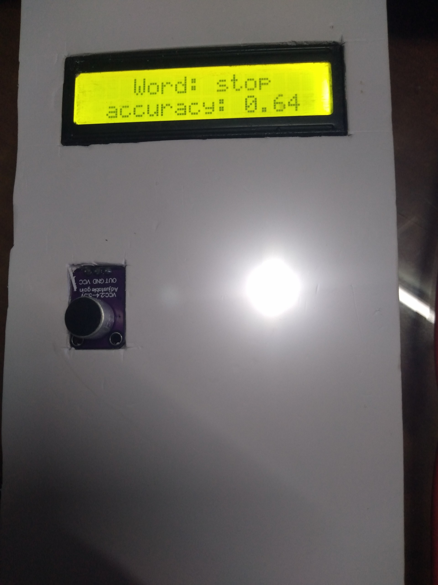
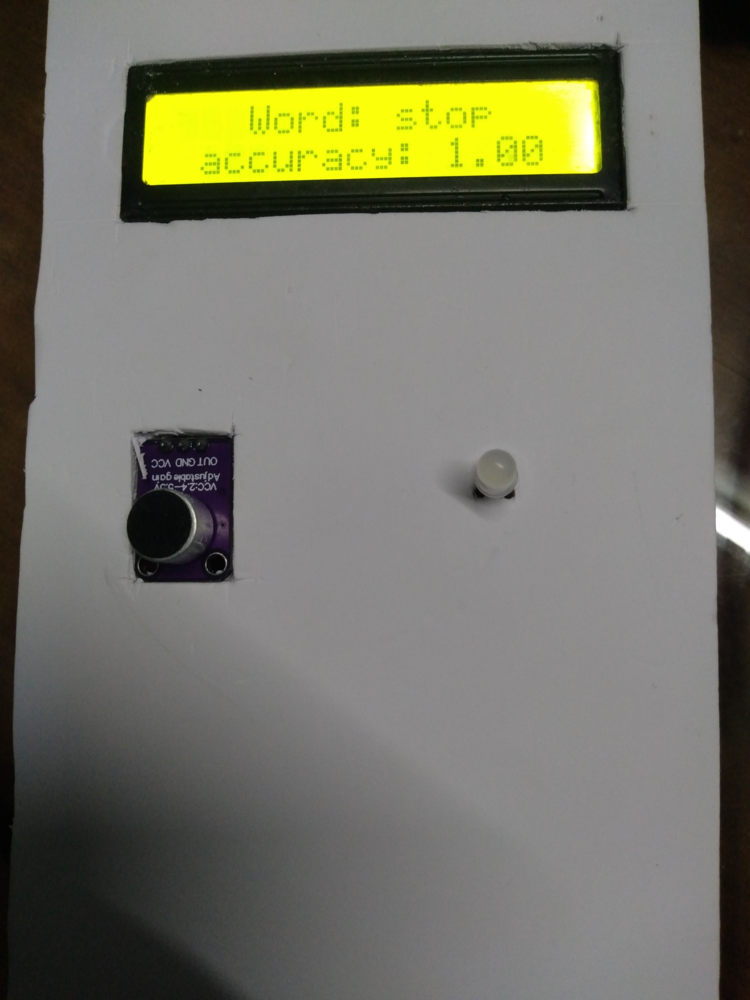
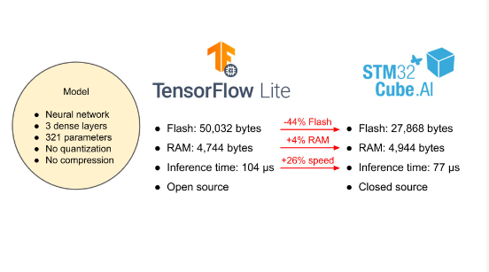

<p align="center">
  <h1 align="center">Speech Recognition on STM32 using STMCube-AI</h1>
</p>

<p align="center">
  <i>Real-time speech command recognition on STM32F429 with neural network deployed via X-CUBE-AI</i>
</p>

<p align="center">
  <a href="#-demo-video">Demo</a> •
  <a href="#-introduction">Introduction</a> •
  <a href="#-project-structure">Project Structure</a> •
  <a href="#-hardware-requirements">Hardware</a> •
  <a href="#-how-it-works">How It Works</a> •
  <a href="#-model-architecture">Model</a> •
  <a href="#-getting-started">Getting Started</a>
</p>

---

## 📹 Demo Video

[](https://drive.google.com/file/d/1tN2GIxc9lGeyg-sjsoDdo86PzAfgeRa6/view?usp=sharing)
*Click the image above or replace the link with your Google Drive demo video link*

> **Note:** `https://drive.google.com/file/d/1tN2GIxc9lGeyg-sjsoDdo86PzAfgeRa6/view?usp=sharing` with your actual Google Drive sharing link so others can watch the product demo easily.

<p align="center">
  
  
  <br/>
  <i>Device states: LED OFF (left) — LED ON (right) when "stop" command is detected</i>
</p>

---

## 📖 Introduction

This project implements a **real-time speech command recognition system** on an STM32F429 microcontroller using a neural network deployed through **STMicroelectronics X-CUBE-AI** toolchain.

The workflow consists of two main phases:

1. **Python — Model Training**
   - Load the **Google Speech Commands v0.02** dataset
   - Extract **MFCC (Mel-Frequency Cepstral Coefficients)** features
   - Train a **Convolutional Neural Network (CNN)** for keyword spotting
   - Convert the trained model to TensorFlow Lite format

2. **STM32 — Model Deployment**
   - Convert the TFLite model to optimized C code using **STM32CubeMX + X-CUBE-AI**
   - Deploy the neural network on the STM32F429 microcontroller
   - Capture audio via **MAX4466 microphone** → **ADC + DMA**
   - Extract MFCC features in real-time using **STM32 AI AudioPreprocessing Library**
   - Run inference and display recognized commands on **I2C LCD**

---

## 🗂️ Project Structure

```
.
├── speech_recognition_and_tracdution.ipynb   # Jupyter notebook for training the model
├── README.md                                 # This file
│
├── all_commands_speech_1/                    # STM32CubeIDE / Keil MDK project
│   ├── Core/
│   │   ├── Inc/                              # Header files (main.h, stm32f4xx_hal_conf.h, ...)
│   │   └── Src/
│   │       ├── main.c                        # Main firmware: audio capture, preprocessing, inference
│   │       ├── stm32f4xx_hal_msp.c           # HAL MSP initialization
│   │       ├── stm32f4xx_it.c                # Interrupt handlers
│   │       └── system_stm32f4xx.c            # System clock configuration
│   │
│   ├── Drivers/                              # STM32 HAL & CMSIS drivers
│   ├── Middlewares/ST/AI/                    # X-CUBE-AI middleware
│   ├── X-CUBE-AI/App/
│   │   ├── app_x-cube-ai.c                   # AI inference wrapper (template)
│   │   ├── app_x-cube-ai.h
│   │   ├── speech_model.c / .h               # Auto-generated neural network model
│   │   ├── speech_model_data.c / .h          # Model weights & data
│   │   ├── speech_model_data_params.c / .h   # Model parameters
│   │   ├── speech_model_config.h             # AI tools configuration
│   │   └── speech_model_generate_report.txt  # Full model analysis report
│   │
│   └── MDK-ARM/                              # Keil MDK project files (uvprojx, ...)
│
├── library/
│   ├── i2c_lcd/                              # I2C LCD driver for HD44780
│   │   ├── inc/i2c-lcd.h
│   │   └── src/i2c-lcd.c
│   │
│   └── STM32_AI_AudioPreprocessing_Library/  # STM32 audio feature extraction library
│       ├── Inc/                              # Headers (feature_extraction.h, mfcc.h, ...)
│       ├── Src/                              # Source files
│       ├── Python/                           # Python reference implementations
│       └── Documentation/html/               # API documentation
│
├── demo/
│   ├── demo_speech_recognition_on_stm32.mp4  # Demo video
│   ├── state_led_off.jpg                     # Photo: LED off state
│   └── state_led_on.jpg                      # Photo: LED on state
│
└── refer/
    ├── compare-tfilte-vs-tflite-convert-stmcubeai.png  # Conversion comparison
    ├── extraction-mfcc-audio.jpg                        # MFCC extraction diagram
    └── max4466-sensor-audio.png                         # MAX4466 sensor image
```

---

## 🛠️ Hardware Requirements

| Component                     | Description                                           |
|-------------------------------|-------------------------------------------------------|
| **MCU Board**                 | STM32F429I (e.g., STM32F429I-DISC1 Discovery board)  |
| **Microphone Sensor**         | MAX4466 Electret Microphone Amplifier                 |
| **Display**                   | I2C LCD (HD44780, 16x2 or 20x4)                      |
| **Additional**                | LEDs, buttons, connecting wires                       |

### Wiring Diagram

| MAX4466 | STM32F429  |
|---------|------------|
| OUT     | PA0 (ADC1) |
| VCC     | 3.3V       |
| GND     | GND        |

| I2C LCD | STM32F429 |
|---------|-----------|
| SDA     | PB7 (I2C1)|
| SCL     | PB6 (I2C1)|
| VCC     | 5V        |
| GND     | GND       |

### Audio Sensor

The [MAX4466](refer/max4466-sensor-audio.png) is an electret microphone amplifier module that provides:
- Adjustable gain (via onboard potentiometer)
- 3.3V–5V operation
- Analog output, filtered and amplified

<p align="center">
  <br/>
  <i>MAX4466 Sound Sensor Module</i>
</p>

---

## ⚙️ How It Works

### Audio Pipeline

```
┌──────────┐    ┌──────────┐    ┌──────────────┐    ┌──────────┐    ┌──────────┐    ┌──────────┐
│ MAX4466  │───▶│ ADC1+DMA │───▶│ PCM Buffer   │───▶│ MFCC     │───▶│ Neural   │───▶│ LCD      │
│ Microphone│   │ PA0,12bit│   │ 15872 samples │   │Feature Ext│   │ Network  │   │ + UART   │
└──────────┘    └──────────┘    └──────────────┘    └──────────┘    └──────────┘    └──────────┘
```

1. **Audio Capture**: The MAX4466 microphone captures sound. The signal is sampled by **ADC1** at **16 kHz** using **DMA** transfer (continuous mode). A buffer of **15,872 PCM samples** (~1 second) is filled.

2. **Preprocessing (MFCC Extraction)**: Using the **STM32 AI AudioPreprocessing Library**:
   - Apply **Hann window** (frame length: 2048, hop length: 512)
   - Compute **FFT** (2048 points) → Power spectrum
   - Apply **Mel filterbank** (128 Mel bands)
   - Take **logarithm** (dB scale)
   - Compute **DCT** → **16 MFCC coefficients** per frame
   - Total: 28 frames × 16 MFCCs = **448 features** (input to the model)

3. **Inference**: The extracted features are fed into the neural network via **X-CUBE-AI** runtime. The model outputs probabilities for **38 classes** (35 speech commands + _silence_, _unknown_, _background_noise_).

4. **Post-processing**: The class with the highest probability is identified. If the recognized word is **"stop"** (index 29), the green LED toggles.

5. **Display**: The recognized word and inference accuracy are shown on the **I2C LCD** and also printed via **UART**.

### Supported Commands (38 classes)

| Category | Words |
|----------|-------|
| Control  | backwarad, bed, bird, cat, dog, down, eight, five, follow, forward, four, go, happy, house, learn, left, marvin, nine, no, off, **on**, one, right, seven, sheila, six, **stop**, three, tree, two, up, visual, wow, **yes**, zero |
| Special  | `_background_noise_`, `_silence_`, `_unknown_` |

---

## 🧠 Model Architecture

The neural network is a **2D Convolutional Neural Network** designed for keyword spotting:

```
Input: (1, 16, 28, 1)   ← 16 MFCCs × 28 frames
  │
  ├─ Conv2D (3×3, 8 filters, ReLU)          → (1, 14, 26, 8)
  ├─ Conv2D (3×3, 8 filters, ReLU)          → (1, 12, 24, 8)
  ├─ MaxPool2D (2×2)                         → (1, 6, 12, 8)
  ├─ Flatten                                 → (576)
  ├─ Dense (64, ReLU)                        → (64)
  ├─ Dense (64, ReLU)                        → (64)
  └─ Dense (38, Softmax)                     → (38)
```

| Metric        | Value      |
|---------------|------------|
| Parameters    | 44,222     |
| Weights size  | 172.74 KiB |
| Activations   | 13.12 KiB  |
| MACCs         | 243,888    |
| Data type     | float32    |
| Format        | TFLite → C (no compression) |

**Model report**: See [speech_model_generate_report.txt](all_commands_speech_1/X-CUBE-AI/App/speech_model_generate_report.txt) for full layer-by-layer details.

---

## 🚀 Getting Started

### 1. Train the Model (Python)

Open the Jupyter notebook:

```bash
jupyter notebook speech_recognition_and_tracdution.ipynb
```

The notebook will:
- Download the **Google Speech Commands v0.02** dataset
- Extract **MFCC** audio features
- Train a CNN model for speech command recognition
- Export the model as a **TensorFlow Lite** file

<p align="center">
  <br/>
  <i>MFCC Feature Extraction Pipeline</i>
</p>

### 2. Deploy to STM32

1. Open **STM32CubeMX** with the `all_commands_speech_1.ioc` project file
2. Install **X-CUBE-AI** pack
3. In the "Software Packs" section, select **X-CUBE-AI** → Add your `.tflite` model
4. Configure: `stm32f4` series, float format, no compression, allocate inputs/outputs
5. Generate code (MDK-ARM / Keil project)
6. Open the generated project in **Keil MDK** and build
7. Flash to the STM32F429 board

### 3. Run the System

1. Power on the board — the LCD displays "Word: stop"
2. Speak a command from the 35-word vocabulary
3. The LCD shows the recognized word and confidence
4. Saying **"stop"** toggles the green LED

---

## 📚 Libraries Used

| Library | Purpose |
|---------|---------|
| **[X-CUBE-AI](https://www.st.com/en/embedded-software/x-cube-ai.html)** v8.1.0 | Neural network deployment on STM32 |
| **[STM32 AI AudioPreprocessing Library](https://www.st.com/en/embedded-software/stm32-ai-audiopreprocessing-library.html)** | Real-time MFCC extraction on MCU |
| **I2C LCD Driver** | Character LCD display control |
| **TensorFlow / Keras** | Model training (Python) |
| **Google Speech Commands Dataset** v0.02 | Training data |

---

## 🔗 References

- [Google Speech Commands Dataset](http://download.tensorflow.org/data/speech_commands_v0.02.tar.gz)
- [STM32CubeMX + X-CUBE-AI Documentation](https://www.st.com/en/embedded-software/x-cube-ai.html)
- [MAX4466 Microphone Module](refer/max4466-sensor-audio.png)

<p align="center">
  <br/>
  <i>TFLite model conversion comparison</i>
</p>

---

<p align="center">
  Made with ❤️ for embedded AI and speech recognition
</p>